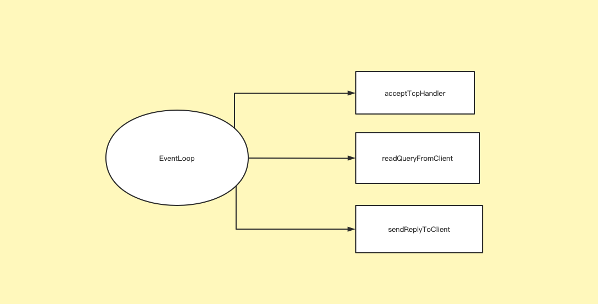
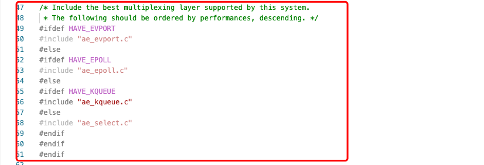
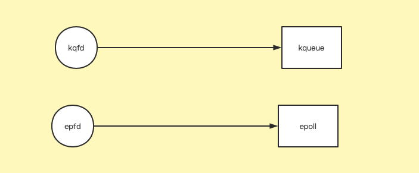
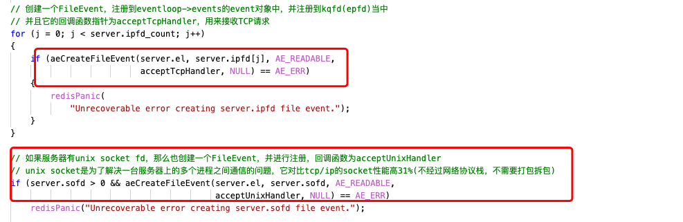
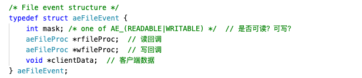
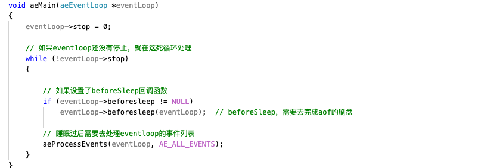
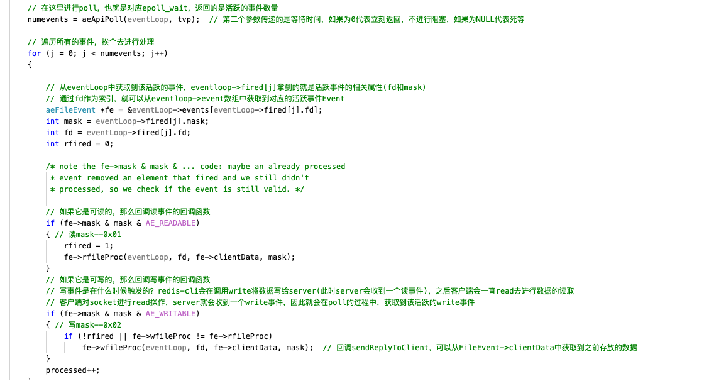
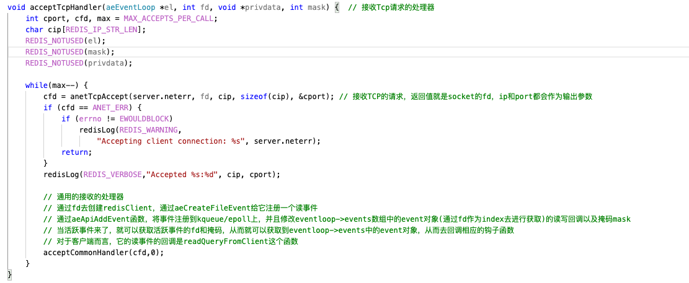
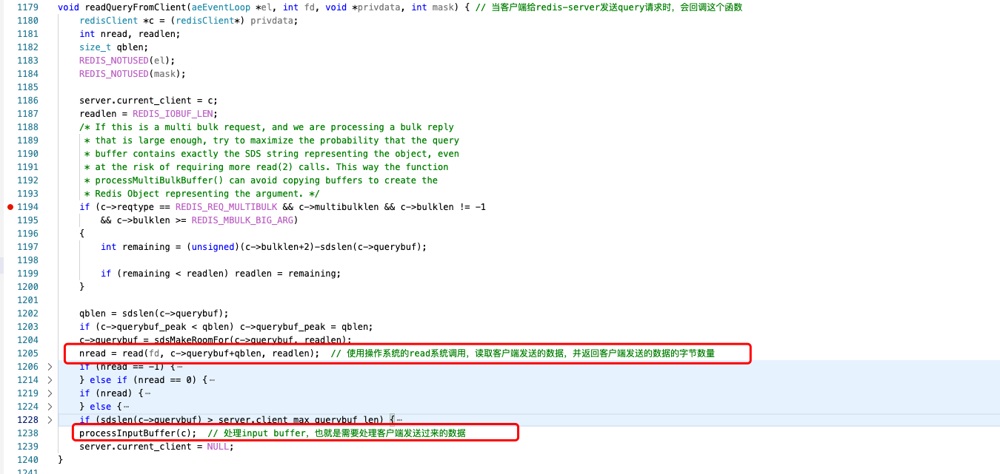
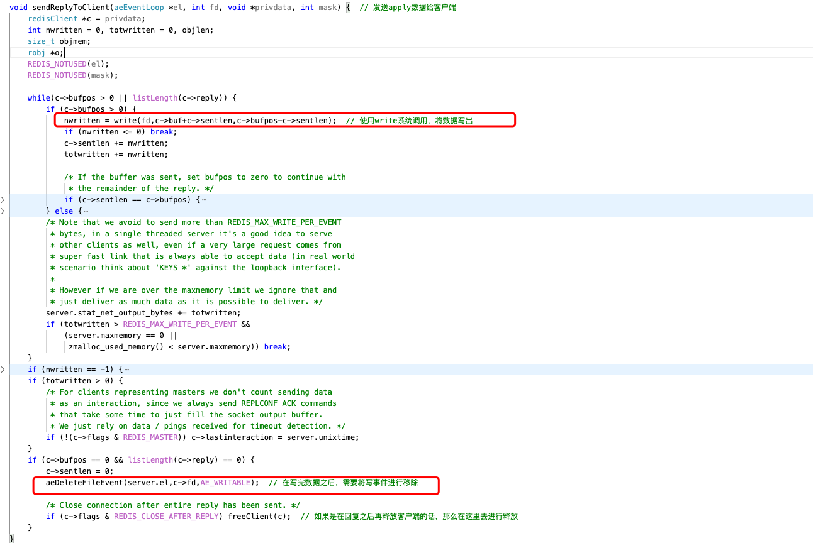

Reactor翻译成为中文是"核反应堆"，在计算机领域似乎被比作"不断处理任务的机器"，在Redis中，采用一个事件循环(EventLoop)，也就是单线程去实现Reactor从而处理各种各样的任务。



## 0.1 Redis针对不同平台实现的nio网络模块

Redis中针对不同的操作系统的平台下，提供了不同的网络实现。实现了包括Linux平台下的Epoll/Select、macOS(FreeBsd)下的KQueue以及Solaris系统下的Evport等模块。


我们可以看到在redis源码的ae.c中有如下的宏，判断当前平台下使用的是哪种nio的实现方式，从而导入对应的实现。比如我现在使用的是macOS操作系统，自然是会导入kqueue的实现，当然现在使用的最多的是Linux系统，导入的自然就是epoll的实现。除了select的实现比较久远，其余三者的原理都是想通的，下面我可能会针对于epoll/kqueue这两种nio的实现方式去进行举例。



* 1.kqueue中的kqueue函数相当于epoll中的`epoll_create`函数的功能，在内核空间申请一块空间，存放注册的事件，返回一个fd，指向内核中申请的那块区域，我们称之为epoll对象/kqueue对象，该对象的作用是**管理**已经注册的(读/写)事件列表，以及活跃的事件列表，我们对事件进行注册、删除以及获取活跃事件，都是对该对象去进行操作。
* 2.kqueue中的kevent函数相当于epoll中的`epoll_wait`函数和`epoll_ctl`函数的功能，`epoll_ctl`负责注册/修改/删除事件，而`epoll_wait`是获取当前的就绪的事件列表，kevent则拥有该两者的功能，根据传递的参数的不同。

# 1. Redis-Server对于EventLoop的初始化工作

当redis-server启动时，会完成该EventLoop的初始化工作。



下面以epoll/kqueue为例去进行介绍

* 1.使用`epoll_create`(或者`kqueue`)库函数去创建一个epoll对象(或者`kqueue`对象)，并且返回一个epoll对象(或者是kqueue对象)的fd，也就是epfd(或者kqfd)保存到eventloop对象中。
* 2.创建redis-server的socket，绑定redis-server的端口(默认为6379)，可以获取到redis-server的socket的sockfd，并将sockfd通过`epoll_ctl`(或者`kevent`)函数注册一个读事件到epoll对象(或者kevent对象)当中，并注册回调函数为`acceptTcpHandler`，这个回调函数的作用是处理TCP的连接。
* 3.其实这里如果有使用到unix socket的话，还会将unix socket也注册到eventloop当中，并设置回调函数为`acceptUnixHandler`。unix socket是针对于本机之间的进程通信的，性能比tcp/ip的socket快31%。

> 这里其实有一个注意的点是，如何注册回调函数？
> 我们都知道，`epoll_ctl`(或者`kevent`)函数能注册的仅仅是事件，当活跃事件到来时，我们也仅仅能拿到fd和事件类型(READ/WRITE)。我们如何获取到回调函数呢？其实在eventloop内部维护了一个events[]，通过fd作为索引，就可以获取到一个FileEvent对象，我们将回调函数保存到FileEvent当中不就行了？

真实的逻辑是：在注册时，根据fd获取到FileEvent对象，并设置回调函数；在活跃事件到来时，通过fd拿到FileEvent对象，从中获取到回调函数并进行回调。




# 2. Redis-Server中的EventLoop介绍

EventLoop是什么？我们从字面意思去进行理解：事件循环，实际上它就是一个死循环，用来处理事件的。



每个循环中，通过执行`aeApiPoll`(在`epoll`中对应的就是`epoll_wait`库函数，在`kqueue`中对应的就是`kevent`库函数)，去拿到所有的活跃事件的fd。接着，遍历所有活跃事件的fd，挨个去判断是否可读/可写？然后从events[]中获取到`FileEvent`对象从而获取到回调函数，接着就回调它的读回调函数(`rfileProc`)或者是写回调函数(`wfileProc`)。



## 2.1 EventLoop中连接事件的处理

当客户端连接到redis-server，那么在事件循环执行`aeApiPoll`时就可以获取到该连接事件(连接事件实际上也是一个可读事件)。接着就会回调它的`rfileProc`回调，也就是`acceptTcpHandler`这个函数(这个回调在初始化redis-rerver时就已经被设置好了)。所有的`TCP`的连接事件，就会被该函数去进行处理。



我们可以看到，首先要做的，就是接受客户端的连接，通过执行`accept`函数，获取到接收连接过来的socket的fd。接着，就通过`acceptCommonHandler`，这个函数，将该fd注册一个读事件到eventloop当中的epoll(或kqueue)对象当中，并注册一个读回调`readQueryFromClient`。

## 2.2 EventLoop中读事件的处理

读事件什么时候触发？当客户端(例如`redis-cli`)通过`write`系统调用，将数据写入给redis-server，redis-server就会通过`epoll_wait`(或者`kevent`)函数去收到一个读事件。比如客户端发送了数据"get wanna"就会执行`write`系统调用。

在读事件到来时，就会在`aeApiPoll`中拿到该事件的fd，因此可以在events[]中通过fd拿到FileEvent回调函数，因为该事件是个读事件，因此可以回调的它的`rfileProc`函数，也就是回调`readQueryFromClient`函数。

读事件的处理，就是在该函数中被处理的。



首先，通过`read`系统调用读取来自客户端发送的数据，并保存到querybuf中。接着要做的，自然就是处理客户端发送过来的命令，并将要发送给客户端的数据写入到输出缓冲区当中，并给eventloop的epoll对象当中注册一个写事件，并设置回调函数为`sendReplyToClient`。(这时数据并未发送，只是放在了缓冲区，这个其实是很奇怪的，我最初以为是立马就会将数据写回给客户端的)

## 2.3 EventLoop中写事件的处理

写事件什么时候触发？当客户端通过`read`系统调用，想要去读取redis-server中的数据时，redis-sever就会通过`epoll_wait`(或者`kevent`)函数收到一个写事件。(似乎这个写事件用的很少，在Netty等项目当中，一般都是在处理读事件时，就将数据写入给客户端了，不会利用到写事件。)

Redis的客户端的伪代码应该是类似如下：

```c
    sofd = connect(host,ip);  // 连接redis-server
    while(true) {  // 死循环接收客户端的输入并进行处理
        command = input();   // 用户在终端输入命令
        nwrite = write(sofd, command);  // 将命令写出给redis-server
        nread = read(sofd, data);  // 将redis-server返回的数据进行读取(如果server一直不返回数据，那么一直在这里进行阻塞挂起)
        print(data);  // 将redis-server回复的数据输出到控制台
    }
```

当redis-server收到`write`事件时，同样的，也会被`aeApiPoll`函数中拿到该事件的fd，在events[]中通过fd去获取到`FileEvent`对象，并回调`sendReplyToClient`这个回调函数。



在这个函数中，要做的就是将输出缓冲区的数据通过`write`系统调用将数据写出给客户端。在写出完成之后，并将事件从`eventloop`中去进行移除掉。

## 2.4 对Redis-Server网络模型做一个小总结

* 1.在Redis-Server启动时，注册了连接事件，设置回调函数`acceptTcpHandler`，接着等待客户端发送连接事件。
* 2.在有连接事件到来时，注册读事件，并设置回调函数`readQueryFromClient`，等待客户端发送读事件。
* 3.在有读事件到来时，通过`read`系统调用获取客户端命令，接着处理客户端命令，并将要发送给客户端的数据放入到输出缓冲区，注册写事件，并设置回调函数`sendReplyToClient`，等待客户端发送写事件。
* 4.在写事件到来时，使用`write`系统调用将输出缓冲区中的数据写出给客户端，接着，将写事件从eventloop中取消注册。