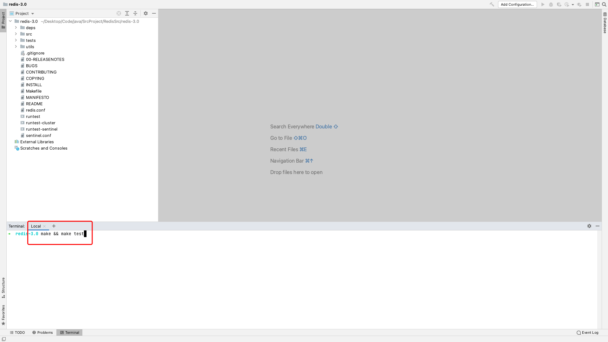
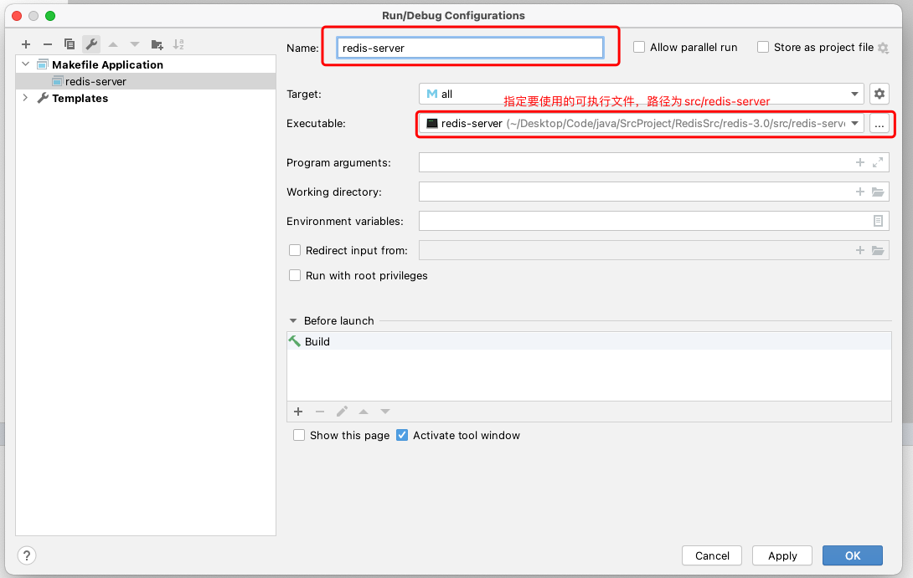
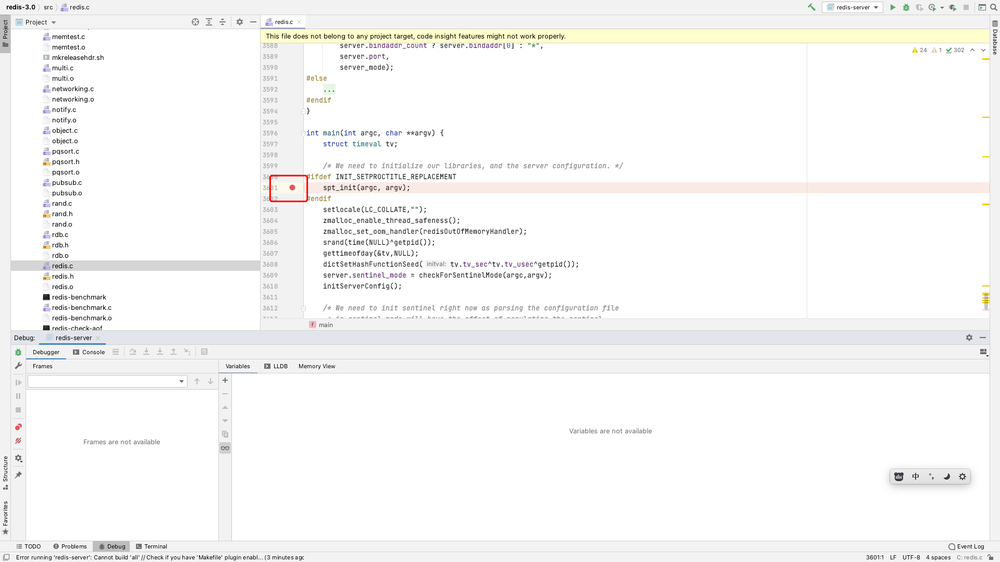
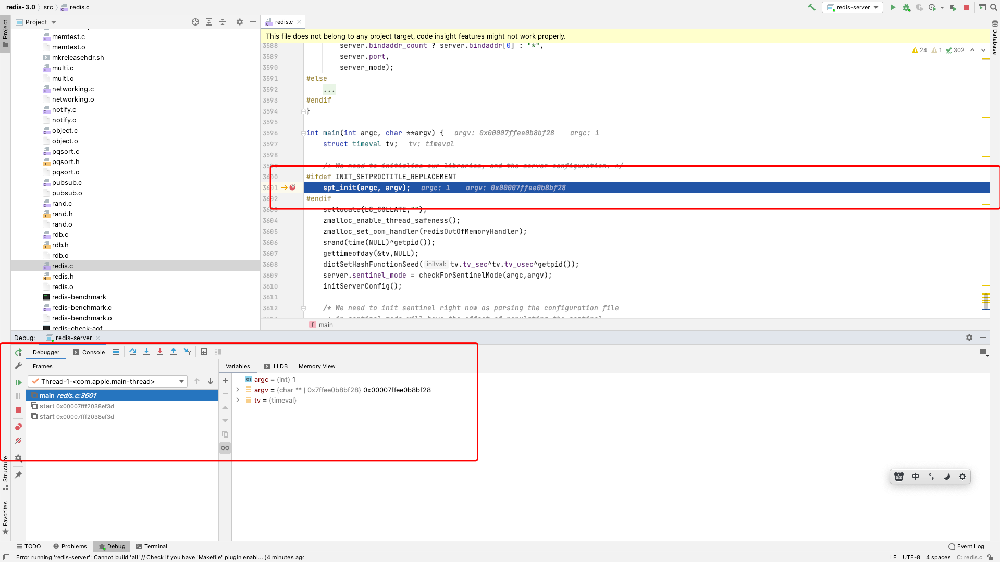
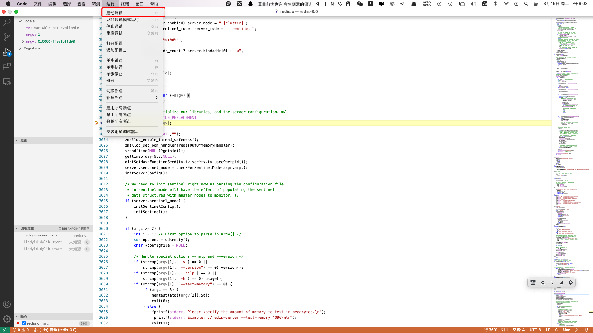

# 1. 下载源码并编译源码

我这里采用的Redis版本为3.0版本，GitHub下载地址为`https://github.com/redis/redis.git`。

打开Redis源码工程，在终端中使用`make && make test`命令去编译Redis源码。

## 1.1 在Clion中进行源码的构建和Debug

使用Clion打开源码工程。



接着，添加一项配置，并指定要执行的"可执行文件"(src/redis-server)，**并将下方的`Before launch`中的`Build`选项去掉**，代表不要每次执行之前都进行一次构建。(如果我们修改了源码，那么就需要使用`make && make test`命令去重新进行编译)



接着，找到`src/redis.c`这个文件，一直往下拉，找到main函数，并给main函数打上一个断点。



点击Debug按钮，我们发现程序停止在我们的断点处，到这里，我们的Redis源码就构建成功啦！



## 1.2 在VSCode中进行源码的构建和Debug

要进行C语言的调试，首先需要在VSCode中安装`C/C++`这个插件。

接着，配置构建任务，在项目目录下，建立一个`.vscode`文件夹，在该文件夹内建立`tasks.json`和`launch.json`两个文件。

VSCode的`tasks.json`用来指定要进行的构建操作

```json
{
    "version": "2.0.0",
    "tasks": [
        {
            "label": "build",
            "type": "shell",
            "command": "make && make test",  // 构建需要指定的命令
            "args": [], // 构建需要的命令行参数
            "group": "build",
            "problemMatcher": "$msCompile"
        }
    ]
}
```

* 1.`command`配置项，用来指定构建要执行的命令。
* 2.`args`配置项，指定命令后面需要跟的命令行参数。


在`launch.json`中配置debug任务

```json
{
    "version": "0.2.0",
    "configurations": [
        {
            "name": "(lldb) 启动",
            "type": "cppdbg",
            "request": "launch",
            "program": "${workspaceFolder}/src/redis-server",
            "args": [], // 程序运行的相关命令行参数
            "stopAtEntry": false,
            "cwd": "${fileDirname}", // 当前文件夹名
            "environment": [], // 需要添加的环境变量
            "externalConsole": false, // 使用启用外部的终端，如果为false会使用集成终端
            "MIMode": "lldb",
            "preLaunchTask": "build" // 在运行之前，需要指定的任务，一般用来进行build，需要对应的是tasks.json中的label
        }
    ]
}
```

* 1.`program`配置项中指定，运行任务要执行的可执行程序，我们这里配置为`项目文件夹/src/redis-server`。
* 2.`args`指定可执行程序执行时所需要的命令行参数。
* 3.`externalConsole`指定是否要使用外部的终端？设置为true运行时会开启一个外部终端，设置为false时，运行时将会使用VSCode内部的集成终端。
* 4.`preLaunchTask`配置项指定在运行之前需要预先执行的任务，需要指定`tasks.json`配置文件中的`label`对应的配置。(如果不配置，那么每次只是执行`redis-server`，不指定预先任务的构建工作)

同样的，找到`src/redis.c`中的main函数，打上断点，依次点击"运行"-"启动调试"，程序就停到我们打的断点的位置。



Redis源码通过VSCode就去构建成功！